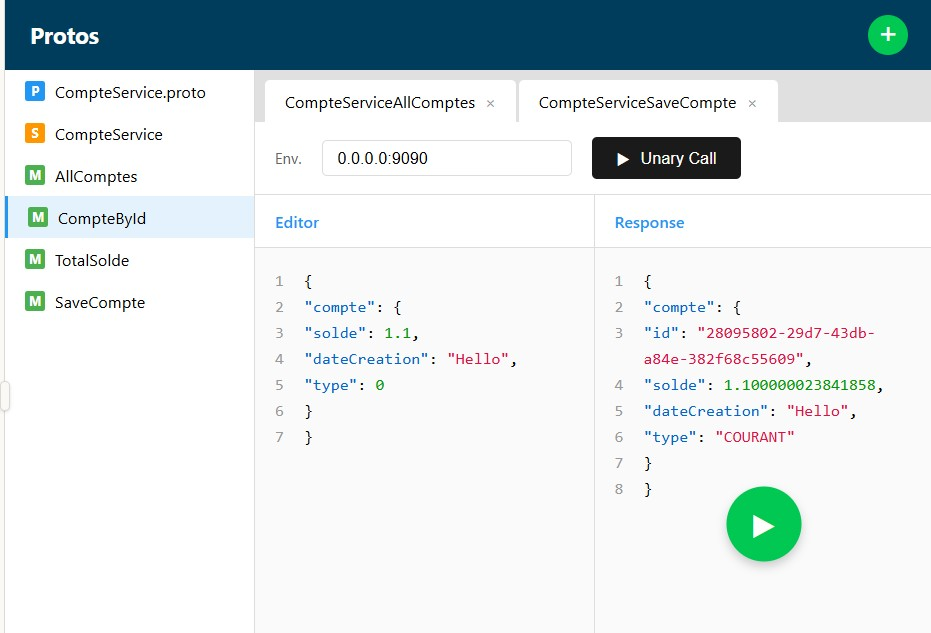

# Service de Gestion de Comptes Bancaires (gRPC + Spring Boot)

Ce projet est une implémentation d'un microservice de gestion de comptes bancaires utilisant **gRPC** pour la communication et **Spring Boot** pour la logique métier et la persistance des données.

## 🚀 Fonctionnalités

Le service expose les méthodes RPC suivantes :
1.  **AllComptes** : Récupérer la liste de tous les comptes.
2.  **CompteById** : Récupérer un compte spécifique via son ID.
3.  **TotalSolde** : Obtenir des statistiques (Nombre de comptes, Somme des soldes, Moyenne).
4.  **SaveCompte** : Créer ou mettre à jour un compte.

## 🛠 Stack Technique

* **Langage** : Java 17
* **Framework** : Spring Boot 3.4.0
* **Communication** : gRPC (Protobuf 3)
* **Base de données** : H2 (In-memory)
* **Build Tool** : Maven
* **OS Supporté** : Windows 64-bit (Configuration Maven spécifique)

## 📂 Structure du Projet

```text
src
├── main
│   ├── proto
│   │   └── CompteService.proto      # Définitions gRPC
│   │
│   └── java
│       └── org
│           └── example
│               └── grpc2
│                   ├── controllers  # Implémentation du service gRPC
│                   ├── entities     # Entités JPA (Base de données)
│                   ├── repositories # Spring Data JPA Repositories
│                   ├── services     # Logique métier
│                   └── stubs        # Classes générées par Protobuf
```
# SaveCompte


# AllComptes


# GetCompteById


# totaleSolde

